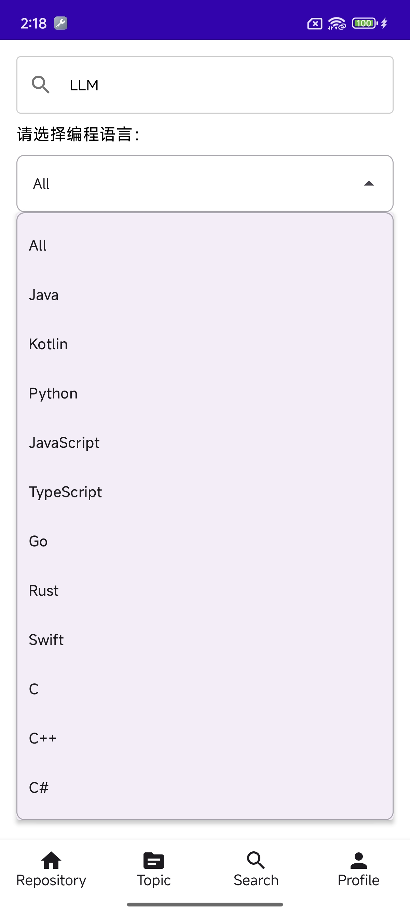
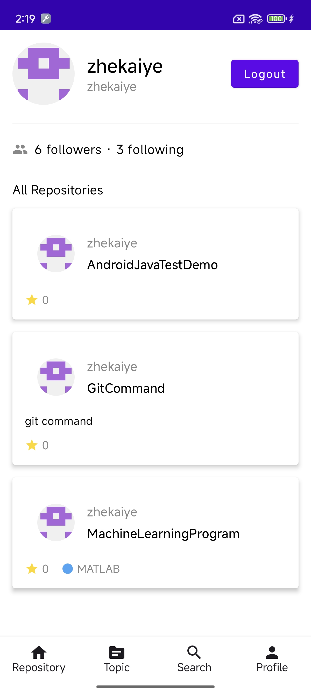
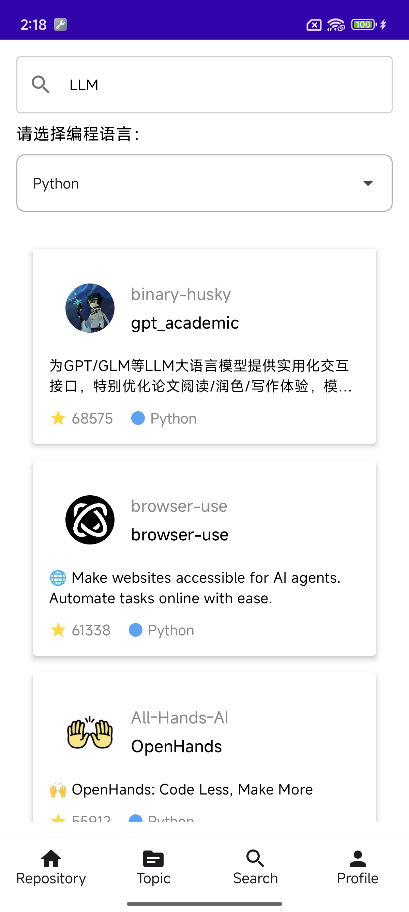
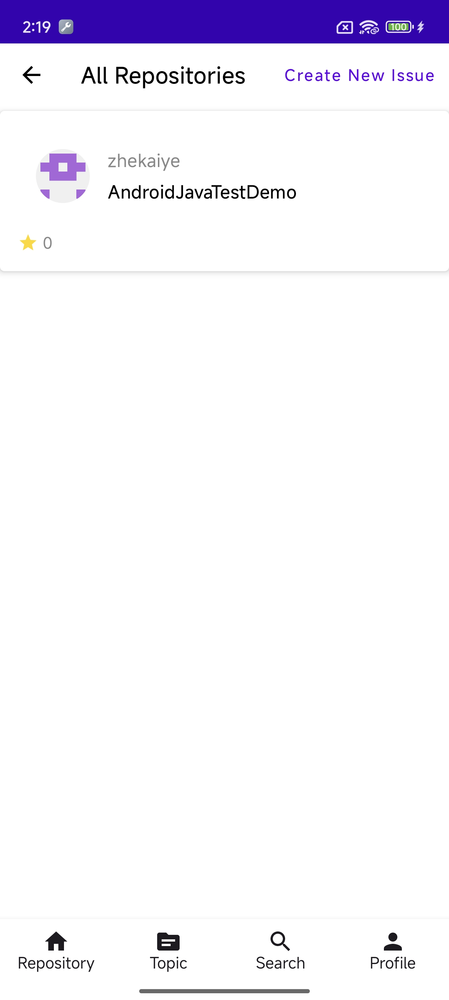
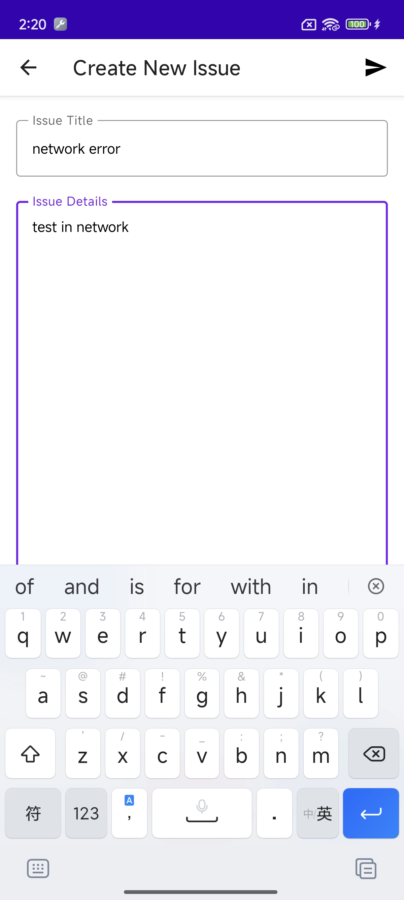
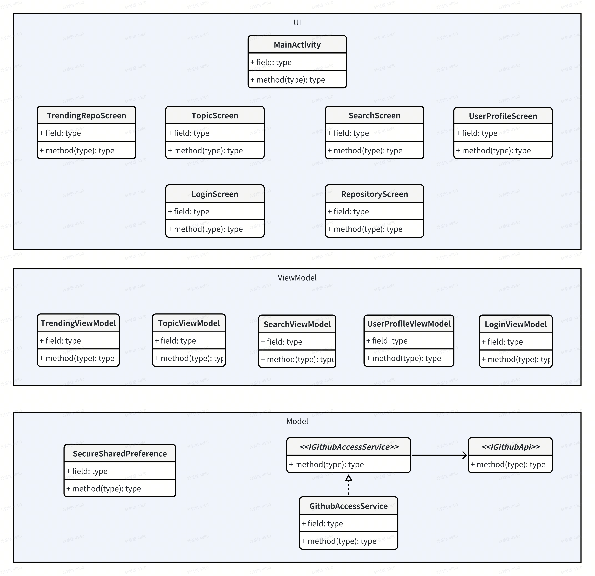

# GithubClientDemo
A demo app of github android client to Github service

## Features

This Github access App contains features as follow:

*   **Browsing Trending Repositories**: Browse Trending GitHub repositories without login.
*   **Browsing Repository Detail**: Browse detailed info of certain repository.
*   **Browsing Topics**: Browse Popular topics on Github.
*   **Search Repositories**: Search for repositories by keywords and language, sorted desc by stars.
*   **Login Github**: Login GitHub by your account and browser your own repositories.
*   **Logout**: Logout GitHub by your account.
*   **Create New Issue**: Create new issue for your own repository after login.
*   **Screen Rotation**: Supports to switch between portrait and landscape mode.
*   **Exception Handling**: Adapter for all kinds of exception: network error etc.

## Screenshots

| Trending                                                 | Topic                                           | Search                                                   | UserProfile                                             |
|----------------------------------------------------------|-------------------------------------------------|----------------------------------------------------------|---------------------------------------------------------|
|     |  |    |  |
|  |                                                 |  |  |
|                                                          |                                                 |                                                          |  |

## Design

Based on MVVM arch pattern.

## Apk Download

